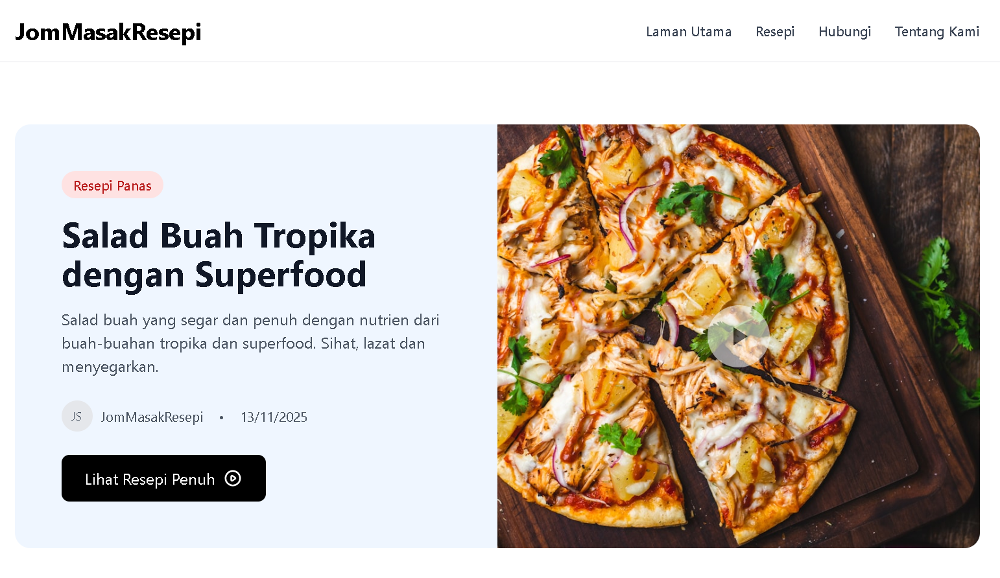

# JomMasakResepi



A modern recipe website for Malaysian cuisine, built with Next.js and Firebase. Browse authentic recipes with detailed ingredients, step-by-step instructions, and nutrition information.

## Features

- 🍳 Collection of Malaysian recipes
- 📱 Responsive design (mobile-first)
- 🔍 Category filtering
- 📊 Nutrition information for each recipe
- 🌐 Full Malay language support
- 💰 Zero cost (Firebase Spark Plan + Vercel Free Tier)
- 📧 Contact form with email integration (Resend)

## Tech Stack

- **Framework**: Next.js 14+ (App Router)
- **Language**: TypeScript
- **Styling**: Tailwind CSS
- **Database**: Firebase Firestore
- **Images**: External URLs (Unsplash)
- **Deployment**: Vercel
- **Validation**: Zod
- **Email**: Resend

## Getting Started

### Prerequisites

- Node.js 18+
- npm/yarn/pnpm
- Firebase account
- Vercel account (for deployment)
- Resend account (free - for contact form)

### Installation

1. Clone the repository

```bash
git clone https://github.com/yourusername/JomMasakResepi.git
cd JomMasakResepi
```

2. Install dependencies

```bash
npm install
```

3. Set up environment variables

Create a `.env.local` file in the root directory:

```env
# Firebase Configuration
NEXT_PUBLIC_FIREBASE_API_KEY=your_api_key_here
NEXT_PUBLIC_FIREBASE_AUTH_DOMAIN=your_project_id.firebaseapp.com
NEXT_PUBLIC_FIREBASE_PROJECT_ID=your_project_id
NEXT_PUBLIC_FIREBASE_MESSAGING_SENDER_ID=your_sender_id
NEXT_PUBLIC_FIREBASE_APP_ID=your_app_id

# Resend API Key (for contact form)
RESEND_API_KEY=re_xxxxxxxxxxxxx
CONTACT_EMAIL=your-email@example.com
```

4. Set up Firebase

- Go to [Firebase Console](https://console.firebase.google.com)
- Create a new project
- Enable **Firestore Database** (start in test mode)
- Copy your Firebase config values to `.env.local`
- Set up Firestore Security Rules (see `firestore.rules`)

5. Seed the database (optional)

```bash
npx tsx scripts/seed-firestore.ts
```

6. Run the development server

```bash
npm run dev
```

Open [http://localhost:3000](http://localhost:3000) to view the app.

## Available Scripts

```bash
# Development
npm run dev          # Start development server
npm run build        # Build for production
npm run start        # Start production server
npm run lint         # Lint code

# Database
npx tsx scripts/seed-firestore.ts        # Seed database with sample recipes
npx tsx scripts/delete-all-recipes.ts    # Delete all recipes from Firestore
npx tsx scripts/create-indexes.ts       # Trigger Firestore index creation
```

## Deployment

### Vercel

1. Push your code to GitHub
2. Import your project on [Vercel](https://vercel.com)
3. Add environment variables from `.env.local`
4. Deploy!

Vercel will automatically deploy on every push to the main branch.

## Project Structure

```
JomMasakResepi/
├── app/                    # Next.js App Router pages
│   ├── page.tsx           # Home page
│   ├── resepi/            # Recipe pages
│   ├── hubungi/           # Contact page
│   └── tentang-kami/      # About page
├── components/            # React components
│   ├── layout/           # Header, Footer
│   ├── recipe/           # Recipe components
│   └── category/         # Category components
├── lib/                  # Utilities
│   ├── firebase/         # Firebase config & helpers
│   ├── utils/            # Utility functions
│   └── validations/      # Zod schemas
├── types/                # TypeScript types
├── scripts/              # Utility scripts
└── public/               # Static assets
```

## License

MIT
